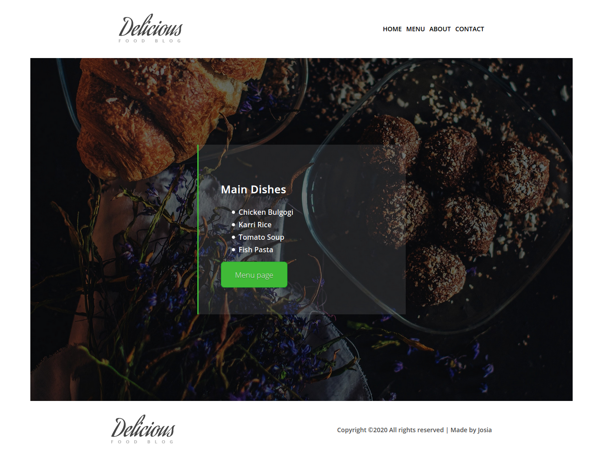
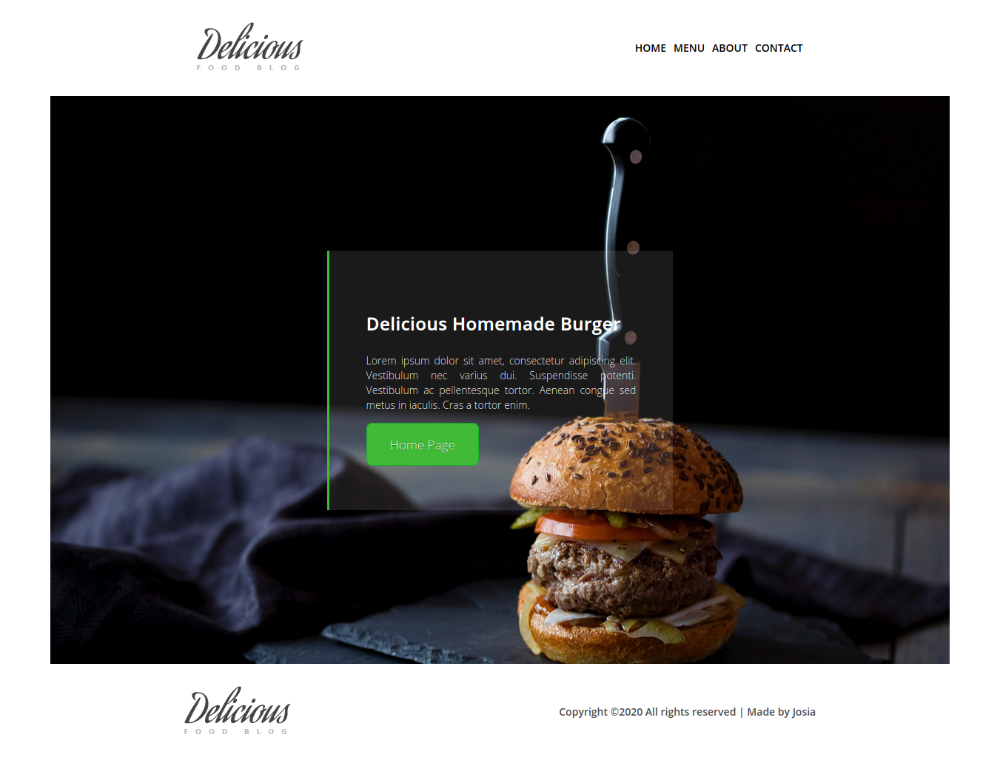

# restaurant
This project consists of DOM manipulation by dynamically rendering a simple restaurant homepage!

By the end, we are going to be using JavaScript alone to generate the entire contents of the website!

## Built with

  * Javascript
  * HTML5
  * CSS3
  * Webpack

## Getting Started:

To get a local copy up and running follow these simple example steps:

1. Under the repository name, click the Clone or download green button.

2. Copy the URL given by clicking the clipboard button

3. Open a terminal window in your local machine and change the current directory to the one you
   want the clone directory to be made.

4. Type  git clone and then paste the URL you previously copied to the clipboard

5. Open your web browser and then open the dist/index.html local file that was copied to the project folder

## See a live demo [Here](https://rawcdn.githack.com/rindrajosia/restaurant/e303f549032cf3537c40772140b2f2217a1806a6/index.html)

## Show your support
Give a ⭐️ if you like this project!

# Screenshot

* Menu page

* Home page

## Authors

👤 **Rindra josia**

* Github: **[@rindrajosia](https://github.com/rindrajosia)**
* Twitter: **[@rindrajosia](https://twitter.com/josia_rindra)**
* Linkedin: **[linkedin](https://www.linkedin.com/in/rindra-josia-99b2111a2/)**

## 🤝 Contributing

Contributions, issues and feature requests are welcome!

Feel free to check the [issues page](https://github.com/rindrajosia/restaurant/issues).

## Show your support

Give a ⭐️ if you like this project!

## Acknowledgments

 - Project from Microverse
 - Originally taken from The Odin Project
